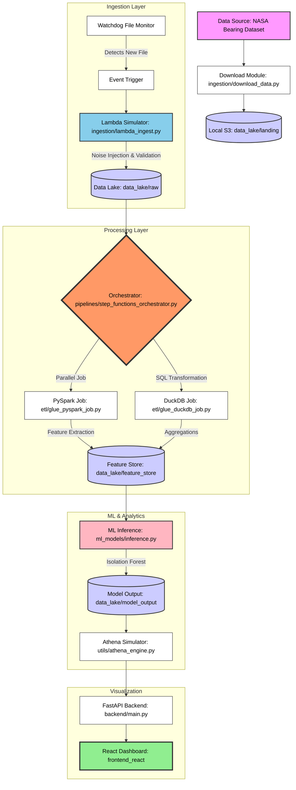

# PulseOps: Industrial Data Lake and Advanced Anomaly Detection Platform

PulseOps is a production-grade, end-to-end data pipeline engineered to monitor and detect anomalies in industrial machinery. Utilizing the NASA Bearing Dataset, this platform emulates a sophisticated cloud-native architecture using local high-performance equivalents. It demonstrates advanced capabilities in data engineering, machine learning, and real-time visualization.

## Project Overview

The system is designed to handle high-frequency vibration data from industrial sensors. It implements a multi-tier data lake, automated ETL pipelines, and unsupervised machine learning models to identify potential equipment failures before they occur, effectively reducing unplanned downtime and maintenance costs.

## Visual Insights

.png)
.png)
.png)
.png)
.png)
.png)

## Key Features

- Automated Data Ingestion: Event-driven ingestion system with real-time file monitoring and noise simulation.
- Multi-Stage Data Lake: Structured storage layers including Landing, Raw, Feature Store, and Model Output.
- Hybrid ETL Engine: Dual processing capabilities using PySpark for large-scale transformations and DuckDB for high-speed SQL-based processing.
- Advanced ML Analytics: Unsupervised anomaly detection using Isolation Forest algorithms on extracted vibration features (RMS, Peak-to-Peak, etc.).
- Orchestrated Pipelines: Custom-built state machine orchestrator that manages task sequencing and error handling.
- Real-Time Dashboard: Interactive React-based frontend providing deep insights into system health and detected anomalies.

## Technical Architecture

The following flowchart illustrates the end-to-end data movement and processing logic within the PulseOps platform.



## End-to-End Workflow

### 1. Data Ingestion
Data enters the system via the `ingestion/download_data.py` script, which fetches vibration datasets. A file system watcher (`watchdog`) monitors the `landing` zone. Upon detection of new data, a simulated AWS Lambda function (`lambda_ingest.py`) is triggered to validate the data, inject synthetic noise to simulate real-world sensor conditions, and move it to the `raw` data zone.

### 2. Orchestration and ETL
The `pipelines/step_functions_orchestrator.py` acts as the brain of the operation, sequencing tasks and managing dependencies. It triggers the ETL layer where:
- PySpark (`etl/glue_pyspark_job.py`) performs heavy-duty feature engineering, calculating Root Mean Square (RMS) and Standard Deviation across vibration windows.
- DuckDB (`etl/glue_duckdb_job.py`) handles metadata management and rapid SQL-based aggregations.
Results are persisted in the `feature_store` in optimized Parquet format.

### 3. Machine Learning Inference
The `ml_models/inference.py` script loads the processed features and applies an Isolation Forest model. This unsupervised approach is ideal for industrial settings where labeled "failure" data is scarce. The model assigns anomaly scores to each data point, identifying deviations from normal operating signatures.

### 4. Analytics and Visualization
The `utils/athena_engine.py` provides a serverless-style SQL interface over the Parquet files. This is consumed by the FastAPI backend, which serves data to the React frontend. The dashboard provides:
- Real-time vibration monitoring.
- Anomaly score heatmaps.
- System health status.
- Detailed breakdown of feature importance.

## Infrastructure Mapping

| AWS Service | PulseOps Equivalent | Implementation Detail |
| :--- | :--- | :--- |
| S3 | Multi-Layer Data Lake | Local file system partitioned as year/month/day |
| Lambda | Event-Driven Ingestor | Watchdog + Python script with noise injection |
| Glue | PySpark / DuckDB ETL Job | Scalable jobs for feature extraction and processing |
| Step Functions | Pipeline Orchestrator | Custom state-machine DAG for task sequencing |
| Athena | DuckDB Query Engine | Serverless SQL queries directly on Parquet files |
| CloudWatch | Execution Logger | Structured logging in the Orchestrator |
| React UI | Vite + Recharts | Interactive dashboard for real-time monitoring |

## Installation and Setup

### Prerequisites
- Python 3.8 or higher
- Node.js and npm
- Java (for PySpark)

### Backend Installation
1. Navigate to the project root.
2. Install Python dependencies:
   ```bash
   pip install -r requirements.txt fastapi uvicorn python-multipart
   ```
3. Run the FastAPI server:
   ```bash
   python backend/main.py
   ```

### Frontend Installation
1. Navigate to the `frontend_react` directory.
2. Install dependencies:
   ```bash
   npm install
   ```
3. Start the development server:
   ```bash
   npm run dev
   ```

## Project Structure

- `assets/`: Documentation assets and screenshots.
- `backend/`: FastAPI application and API routes.
- `data_lake/`: Local storage representing S3 buckets (landing, raw, feature_store, model_output).
- `etl/`: Transformation scripts for PySpark and DuckDB.
- `ingestion/`: Data acquisition and ingestion logic.
- `ml_models/`: Machine learning training and inference scripts.
- `pipelines/`: Orchestration logic and state machine definitions.
- `utils/`: Shared utilities and database engines.

## Industrial Use Case

This platform is specifically designed for predictive maintenance in manufacturing environments. By monitoring rotating components such as bearings and motors, PulseOps can identify early signs of wear and tear, allowing maintenance teams to intervene before catastrophic failure occurs.
