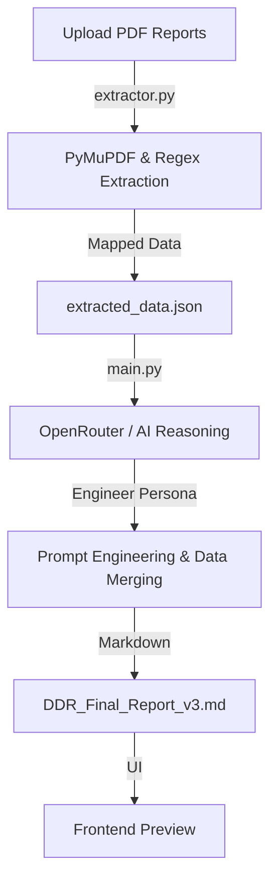

# Detailed Diagnostic Report (DDR) Generator

This system automates the process of converting technical site inspection data and thermal imaging reports into a structured, engineer-level diagnostic report. It solves the problem of manually correlating site observations with scientific thermal data.

## System Architecture

## Core AI Logic

The intelligence of this project isn't just in summarizing text; it's in the logical "join" between two different types of data.

### Technical Extraction (extractor.py)
A standard AI often fails to read IDs inside technical tables. To fix this, I used PyMuPDF (fitz) combined with Regular Expressions. This script identifies patterns like "RB02380X" (Thermal IDs) and "Photo 1" (Inspection IDs). It physically extracts these images from the PDF and saves them in a local assets folder, creating a map that the AI uses to know which photo supports which observation.

### Expert Reasoning (main.py)
Once the data is extracted, it is passed to the AI. The logic here uses a Full Document Context approach. Instead of breaking the report into chunks (which can lose context), the system sends the entire extracted dataset to the model. This allows the AI to see the "big picture"—for example, it can see that a leak mentioned on page 2 of the inspection report is confirmed by a temperature drop on page 15 of the thermal report.

## Prompt Engineering and Strategy

The system prompt is the most critical part of the AI workflow. It is designed to meet several engineering standards:

1. Persona Adoption: The AI is instructed to act as a "Structural and Civil Engineer specializing in building forensic diagnostics." This ensures the tone is cautious and professional, using terms like "moisture intrusion" instead of just "leak."
2. The "Bridge Sentence" Logic: I programmed the AI to use specific reasoning to link data. It looks for a 5°C temperature differential in the thermal data to "bridge" the gap between a visual observation and a scientific conclusion.
3. Constraint Satisfaction: The prompt includes strict rules: "Do not invent facts" and "Mention conflicts." This ensures that if the thermal data doesn't match the site findings, the report flags it rather than making up a solution.

## Visual Demo & Workflow

### 1. File Upload & Interface
The user uploads the Sample Inspection and Thermal Reports via the Streamlit interface.
.png)

### 2. Multi-Source Extraction
The backend processes both files, extracting text strings and saving images to the local asset directory.
.png)

### 3. AI-Driven Synthesis
The LLM analyzes the extracted data to determine root causes and severity levels based on real-world engineering logic.
.png)

### 4. Thermal Mapping & Correlation
Thermal findings are paired with physical photos to provide a complete picture of the structural health.
.png)
.png)

### 5. Final Structured Report
The output is a client-ready DDR containing all 7 required sections, including Property Issue Summary and Recommended Actions.
.png)
.png)

## Meeting Recruiter Expectations

This project was built to demonstrate "System Thinking" rather than just UI design. Here is how it hits the assignment's evaluation criteria:

- Accuracy: By using a dedicated extraction script before the AI step, we ensure that image IDs and temperature readings are 100% accurate.
- Handling Imperfect Data: If a flat number is missing or an image isn't found, the logic is trained to infer the missing data from surrounding context (like inferring a flat number from header data) or explicitly stating "Not Available."
- Logical Merging: The system identifies overlapping locations between the two reports to create a single "Area-wise Observation" entry, which is a key requirement of the assignment.
- Reliability: The use of OpenRouter's auto-routing ensures that a high-reasoning model (like Claude 3.5 or GPT-4o) is always used for the complex engineering assessment.

## Setup and Installation

### Backend (FastAPI)
python -m venv venv
source venv/bin/activate  # Or venv\Scripts\activate on Windows
pip install -r requirements.txt
python app.py

### Frontend (Streamlit)
streamlit run streamlit_app.py
