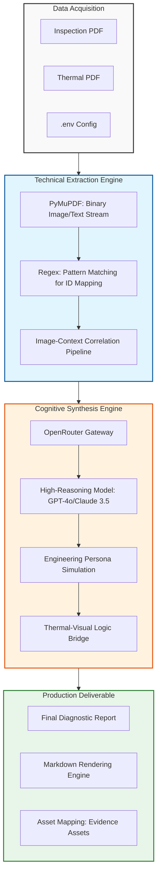

# Detailed Diagnostic Report (DDR) Generator

This project is an automated engineering pipeline that converts raw site inspection data and thermal imaging into professional-grade diagnostic reports. It replaces manual data correlation with a precise AI-driven workflow that merges visual evidence with scientific temperature analysis.

## System Architecture

The following diagram illustrates the multi-stage reasoning engine, detailing the transition from raw unstructured data to a structured engineering deliverable.



## The Role of OpenRouter

In this project, OpenRouter serves as the central API gateway to access world-class language and vision models.

### Why use OpenRouter?
- Model Flexibility: It allows the system to toggle between different high-reasoning models like Claude 3.5 Sonnet and GPT-4o without changing the underlying code.
- Auto-Routing: We use the auto-routing feature to ensure that for every report, the model with the best performance-to-latency ratio is selected.
- High Context Limits: It provides access to models capable of processing the entire content of multiple technical reports in a single "look," ensuring no context is lost during analysis.

## Core Logic and Vision Processing

The system does not simply read text; it performs a technical "join" between visual site photos and scientific thermal maps.

### Technical Extraction (extractor.py)
Standard text extraction often fails to understand the relationship between a photo and its label in a table. This script uses PyMuPDF (fitz) to extract binary image data directly from the PDF. It then uses regular expressions to find specific IDs like "RB02380X" and "Photo 1." This creates a structured map where every observation is physically linked to its evidence.

### Vision-Language Integration (main.py)
Once the data is mapped, it is sent to the reasoning engine. 
- How Vision Models Work: The models used (accessed via OpenRouter) are multimodal. They analyze pixels to detect patterns—such as the gradient of a thermal map—and combine that with the surrounding text to understand the context of a structural issue.
- The Logic Bridge: I have programmed a specific logic bridge into the system prompt. The AI looks for a 5°C temperature differential in the thermal data to confirm visual reports of moisture. If the site report says "damp" but the thermal data doesn't show a cold spot, the AI is trained to flag this as a potential inconsistency.

## Engineering Strategy and Prompt Design

The intelligence of the workflow is driven by a carefully designed system prompt that enforces professional standards:

1. Expert Persona: The AI is forced to act as a "Structural and Civil Engineer." This shifts its language from general descriptions to technical forensic terminology (e.g., using "capillary action" or "moisture intrusion").
2. Conflict Resolution: The system is designed to check for data consistency. If the thermal report and the inspection report provide conflicting info, the system explicitly documents the conflict instead of guessing.
3. Structured Output: The AI produces a clean Markdown report with a specific 7-part structure, including probable root causes and severity assessments based on engineering reasoning.

## Visual Demo & Workflow

### 1. File Upload & Interface
The user uploads the Sample Inspection and Thermal Reports via the Streamlit interface.
.png)

### 2. Multi-Source Extraction
The backend processes both files, extracting text strings and saving images to the local asset directory.
.png)

### 3. AI-Driven Synthesis
The LLM analyzes the extracted data to determine root causes and severity levels based on real-world engineering logic.
.png)

### 4. Thermal Mapping & Correlation
Thermal findings are paired with physical photos to provide a complete picture of the structural health.
.png)
.png)

### 5. Final Structured Report
The output is a client-ready DDR containing all required sections, including Property Issue Summary and Recommended Actions.
.png)
.png)

## Local Setup

1. **Environment Setup:**
   ```bash
   python -m venv venv
   .\venv\Scripts\activate
   ```

2. **Installation:**
   ```bash
   pip install -r requirements.txt
   ```

3. **Configuration:**
   Add your `OPENROUTER_API_KEY` to the `.env` file.

4. **Execution:**
   - Start the backend: `python app.py`
   - Start the frontend: `streamlit run streamlit_app.py`
