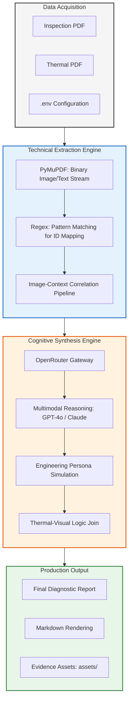

# Detailed Diagnostic Report (DDR) Generator

This implementation provides an automated solution for converting raw, multi-source structural inspection data into professional, client-ready diagnostic reports. The system is designed to handle the logical merging of physical site observations with technical thermal findings, ensuring high accuracy and structural integrity.

## System Architecture

The following diagram illustrates the multi-layered reasoning engine, from technical data acquisition to the final synthesis and correlation layers.



## The Role of OpenRouter

OpenRouter serves as the central API gateway for the project, providing a unified interface to access world-class language and vision models. 

### Why OpenRouter is used:
- Model Versatility: It allows the system to switch between different high-reasoning models like Claude 3.5 Sonnet and GPT-4o without changing the backend logic.
- Performance Optimization: It automatically routes requests to ensure that the most efficient and accurate model is used for complex engineering assessments.
- Unified Integration: By using one API, the system can leverage multiple model providers, ensuring high availability and reliability for processing technical documents.

## Handling Image and Visual Data

A core feature of this system is its ability to handle technical visual evidence alongside text.

### Technical Extraction Logic
Standard text extractors often miss the relationship between a photo and its label. This project uses a custom pipeline built with PyMuPDF to extract binary image data directly from the source PDFs. We use regular expressions to identify specific IDs like "Photo 1" or "RB02380X" within the report text. This creates a mapping table that ensures every site observation is physically linked to the correct evidence file.

### Multimodal Vision Analysis
The system leverages multimodal AI models that process both text and pixels. When an image is sent to the reasoning engine, the model analyzes the visual patterns—such as the color gradients in a thermal map—to confirm structural issues like moisture intrusion or heat loss.

### Logic Bridge
The system prompt includes a "logic bridge" that forces the AI to look for a 5°C temperature differential in the thermal data before confirming a visual report of moisture. This ensures that the final report is backed by scientific data rather than just visual guesswork.

## Visual Demo & Workflow

### 1. File Upload & Interface
The user uploads the Sample Inspection and Thermal Reports via the Streamlit interface.
.png)

### 2. Multi-Source Extraction
The backend processes both files, extracting text strings and saving images to the local asset directory.
.png)

### 3. AI-Driven Synthesis
The LLM analyzes the extracted data to determine root causes and severity levels based on real-world engineering logic.
.png)

### 4. Thermal Mapping & Correlation
Thermal findings are paired with physical photos to provide a complete picture of the structural health.
.png)
.png)

### 5. Final Structured Report
The output is a client-ready DDR containing all 7 required sections, including Property Issue Summary and Recommended Actions.
.png)
.png)

## Local Setup

1. **Environment Setup:**
   ```bash
   python -m venv venv
   .\venv\Scripts\activate
   ```

2. **Installation:**
   ```bash
   pip install -r requirements.txt
   ```

3. **Configuration:**
   Add your `OPENROUTER_API_KEY` to the `.env` file.

4. **Execution:**
   - Start the backend: `python app.py`
   - Start the frontend: `streamlit run streamlit_app.py`
