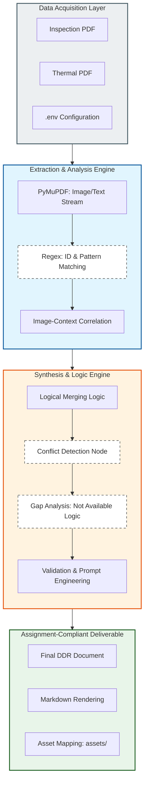

# Applied AI Builder: Automated Detailed Diagnostic Report (DDR) Workflow

This technical implementation provides an automated solution for converting raw, multi-source structural inspection data into professional, client-ready forensic reports. The system is designed to handle the logical merging of physical site observations with thermal diagnostic findings, ensuring high accuracy and structural integrity.

## Advanced System Architecture

The following diagram details the multi-layered reasoning engine, from raw data extraction to the final synthesis and conflict resolution layers.



## Technical Stack

| Category | Technology |
| :--- | :--- |
| Frontend Framework | Streamlit (Interactive UI) |
| Backend Framework | FastAPI (REST API Engine) |
| Data Extraction | PyMuPDF (fitz) |
| AI Reasoning | OpenRouter API / LLM |
| Language | Python 3.8+ |
| Image Processing | Regex-based Asset Mapping |

## Core Engineering Principles (Assignment Compliance)

### 1. Intelligent Data Merging
The system identifies corresponding areas across different documents by correlating "Photo IDs" with "Thermal IDs." This ensures that a moisture reading from a thermal camera is accurately placed alongside the physical observation of the same structural element.

### 2. Handling Missing and Conflicting Data
In adherence to professional engineering standards, the system follows strict rules:
- **Conflict Management:** If temperature readings contradict physical observations (e.g., "Dry" text vs "Wet" thermal), the report explicitly highlights the discrepancy.
- **Data Gap Identification:** If an area lacks an image or data, the system explicitly labels the section as "Not Available" or "Image Not Available" rather than inventing facts.
- **Anti-Hallucination:** The AI engine is constrained by a system prompt that forbids the creation of information not present in the source files.

### 3. Image Contextualization
Images are extracted and contextualized. Each image is placed directly under the observation it supports. The system filters out unrelated assets (logos/icons) to ensure only relevant diagnostic evidence is included.

## Visual Demo & Workflow

### 1. File Upload & Interface
The user uploads the Sample Inspection and Thermal Reports via the Streamlit interface.
.png)

### 2. Multi-Source Extraction
The backend processes both files, extracting text strings and saving images to the local asset directory.
.png)

### 3. AI-Driven Synthesis
The LLM analyzes the extracted data to determine root causes and severity levels based on real-world engineering logic.
.png)

### 4. Thermal Mapping & Correlation
Thermal findings are paired with physical photos to provide a complete picture of the structural health.
.png)
.png)

### 5. Final Structured Report
The output is a client-ready DDR containing all 7 required sections, including Property Issue Summary and Recommended Actions.
.png)
.png)

## Local Setup

1. **Environment Setup:**
   ```bash
   python -m venv venv
   .\venv\Scripts\activate
   ```

2. **Installation:**
   ```bash
   pip install -r requirements.txt
   ```

3. **Configuration:**
   Add your `OPENROUTER_API_KEY` to the `.env` file.

4. **Execution:**
   - Start the backend: `python app.py`
   - Start the frontend: `streamlit run streamlit_app.py`
