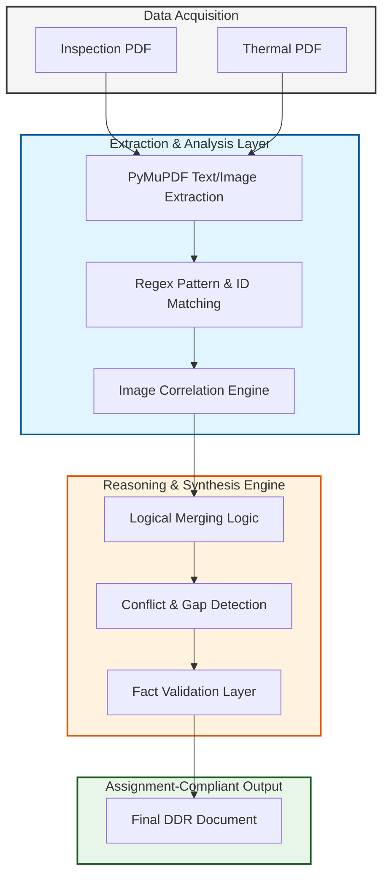

# Applied AI Builder: Automated Detailed Diagnostic Report (DDR) Workflow

This project is a technical implementation designed to solve the challenge of converting raw, multi-source structural inspection data into professional, client-ready deliverables. The system specializes in the logical merging of physical site observations with thermal diagnostic data, ensuring high accuracy and structural integrity in forensic engineering reporting.

## Objective

The primary goal of this system is to automate the extraction and synthesis of data from two distinct sources:
1.  **Site Inspection Reports:** Qualitative observations and physical photo evidence.
2.  **Thermal Imaging Documents:** Quantitative temperature readings and infrared findings.

The system is engineered to handle "imperfect data" by identifying conflicts, recognizing missing information, and ensuring that no facts are invented beyond what is present in the source documents.

## System Architecture and Logic Flow

The following diagram illustrates the reasoning engine behind the workflow, focusing on the data merging and validation layers.

## Core Engineering Principles

### 1. Intelligent Data Merging
The system identifies corresponding areas across different documents by correlating "Photo IDs" with "Thermal IDs." This ensures that a moisture reading from a thermal camera is accurately placed alongside the physical observation of the same wall or ceiling.

### 2. Handling Missing and Conflicting Data
In adherence to professional engineering standards, the system follows strict rules:
-   **Conflicts:** If temperature readings contradict physical dryness, the report explicitly highlights the discrepancy for human review.
-   **Missing Data:** If an area is mentioned but lacks an image or temperature data, the system explicitly labels the section as "Not Available" or "Image Not Available" rather than omitting it.
-   **No Hallucination:** The AI engine is constrained by a system prompt that forbids the invention of facts or the use of generic placeholder text.

### 3. Image Integration
Images are not just extracted; they are contextualized. Each image is placed directly under the observation it supports. The system filters out unrelated assets (like company logos or icons) to ensure only relevant diagnostic evidence is included.

## Output Structure

The generated DDR follows the mandatory 7-point structure required for a professional deliverable:
1.  **Property Issue Summary:** High-level executive overview.
2.  **Area-wise Observations:** Grouped findings with integrated physical and thermal images.
3.  **Probable Root Cause:** Expert reasoning based on the merged data.
4.  **Severity Assessment:** Moderate to High ratings with bulleted technical reasoning.
5.  **Recommended Actions:** Practical, step-by-step remediation plans.
6.  **Additional Notes:** Supplementary engineering context.
7.  **Missing or Unclear Information:** Explicit list of data gaps (e.g., "Flat Number: Not Available").

## Technical Stack

| Category | Technology |
| :--- | :--- |
| Framework | FastAPI (Backend) & Streamlit (Frontend/UI) |
| Extraction | PyMuPDF (High-fidelity PDF parsing) |
| Reasoning | OpenRouter / LLM (Context-aware synthesis) |
| Environment | Python 3.8+ |

## Generalization Capability

While this version is demonstrated using specific sample reports, the extraction logic uses generic pattern matching (Regex) and structural analysis that allows it to work on any inspection report following a similar technical format. This makes the system a scalable solution for architectural and engineering firms.
