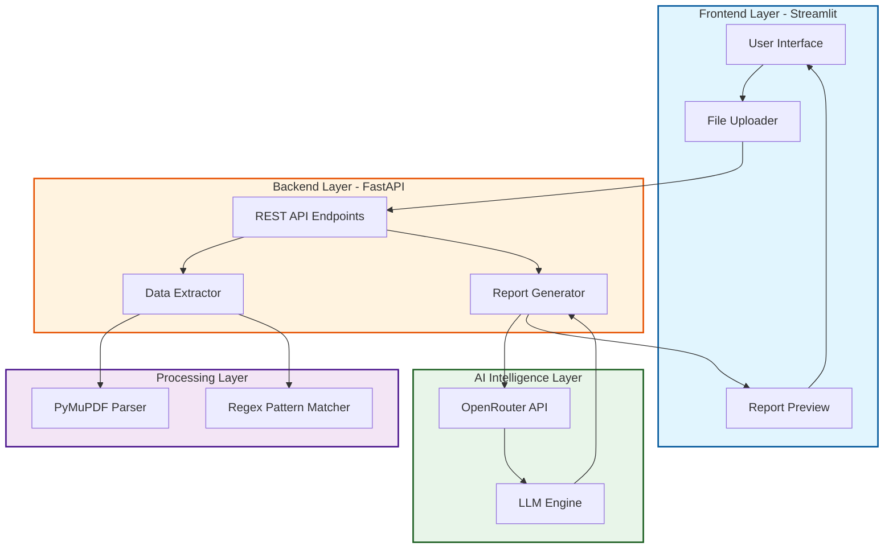

# Detailed Diagnostic Report (DDR) Generator

This professional tool automates the generation of structural forensic diagnostic reports by analyzing site inspection data and thermal imaging. It leverages advanced Large Language Models (LLMs) to provide expert-level engineering insights, root cause analysis, and remediation strategies.

## Architecture



## Technical Stack

| Category | Technology |
| :--- | :--- |
| Frontend | Streamlit |
| Backend | FastAPI |
| Language | Python |
| PDF Processing | PyMuPDF (fitz) |
| AI Integration | OpenRouter API |
| Environment | Python Dotenv |
| API Server | Uvicorn |

## Project Overview

The DDR Generator streamlines the workflow for structural and civil engineers. By uploading site inspection reports and thermal imaging PDFs, the system automatically:

1.  Identifies moisture intrusion patterns.
2.  Correlates thermal anomalies with physical observations.
3.  Determines probable root causes using expert engineering logic.
4.  Assesses severity and recommends practical actions.

## Visual Demo

### Application Interface
.png)

### Data Extraction Process
.png)

### Structural Analysis
.png)

### Thermal Mapping
.png)

### Image Correlation
.png)

### Expert Report Generation
.png)

### Final DDR Preview
.png)
.png)
.png)

## Local Setup

### Prerequisites
- Python 3.8+
- OpenRouter API Key

### Installation

1. Clone the repository:
   ```bash
   git clone https://github.com/Aftab0904/Applied-AI-Builder.git
   cd ddr_generator_portable
   ```

2. Create and activate a virtual environment:
   ```bash
   python -m venv venv
   # Windows
   .\venv\Scripts\activate
   # Linux/macOS
   source venv/bin/activate
   ```

3. Install dependencies:
   ```bash
   pip install -r requirements.txt
   ```

4. Configure environment variables:
   Create a `.env` file and add your API key:
   ```text
   OPENROUTER_API_KEY=your_api_key_here
   ```

5. Run the application:
   ```bash
   # Start backend
   python app.py
   
   # Start frontend (in a new terminal)
   streamlit run streamlit_app.py
   ```
